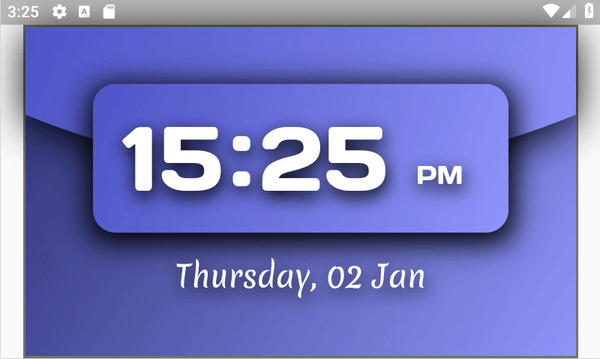
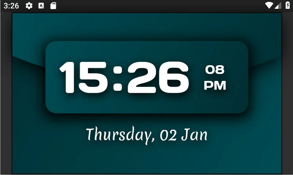

# Digital Clock

This app is an example of a digital clock.
It has a light theme and a dark theme.
See the [Analog Clock](../analog_clock) if you'd like an example that displays the weather and location.

